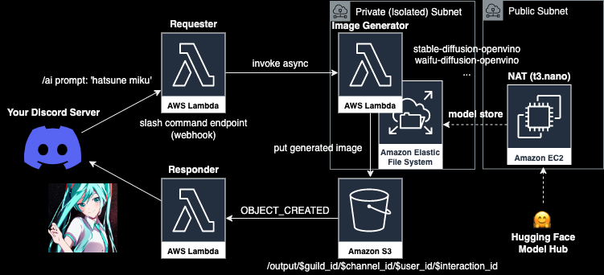

# serverless-diffusion-discord

Stable Diffusion Discord Bot interface.




1. [Create your Discord App](https://discord.com/developers/applications).
2. Create your AWS resources.

```
npm install
npm run cdk deploy -c publicKey=$DISCORD_APP_PUBLIC_KEY -c botToken=$DISCORD_APP_BOT_TOKEN
```

3. Add `imageRequestHandler` function url (https://*.lambda-url.REGION.on.aws) to App `INTERACTIONS ENDPOINT URL`.
4. Add Discord App to your server with `bot` scope.
5. use `/ai` command in your server channel. enjoy!
